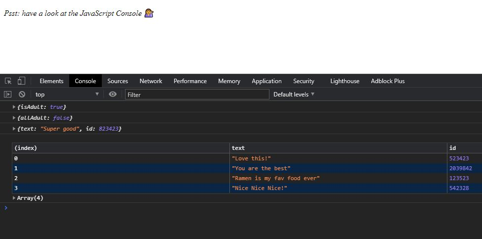

# ArrayCardio2

This is from day 7 / 30 of Wes Bos' JavaScript30 course. In this lesson we played around with the some(), find(), and every() methods. If you're interested you can find the course lessons <a href src"https://www.youtube.com/watch?v=QNmRfyNg1lw&list=PLu8EoSxDXHP6CGK4YVJhL_VWetA865GOH&index=7"> here. </a> 

